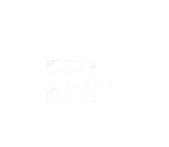

# 🍔 M-Bite Food Delivery Web App

<p align="center">
  
</p>

<p align="center">
  <b>Hệ thống sàn giao dịch đặt đồ ăn trực tuyến hiện đại, mượt mà và bảo mật cao</b><br>
  Fullstack: <i>Node.js / Express + React 19 / Vite + MySQL</i>
</p>

<p align="center">
  
  
  
  
  
</p>

---

## 📌 Giới thiệu dự án

**M-Bite** là nền tảng đặt đồ ăn trực tuyến đa phân quyền với giao diện chuẩn Dark Theme tinh tế, thiết kế công thái học tối giản và tốc độ phản hồi thời gian thực. Hệ thống giải quyết trọn vẹn luồng tương tác giữa 3 đối tượng người dùng chính:
1. **Quản trị viên sàn (Admin)**: Quản lý thành viên, phân quyền, phát hành voucher ưu đãi toàn sàn, xét duyệt khiếu nại/phản hồi.
2. **Chủ nhà hàng (Seller)**: Quản lý menu món ăn (giá, hết hàng, danh mục), tiếp nhận và xử lý đơn hàng theo quy trình chuẩn.
3. **Khách hàng (Buyer)**: Khám phá quán ăn, săn voucher vào Ví cá nhân, đặt món (COD / VietQR), thả tim quán yêu thích và theo dõi trạng thái đơn hàng.

---

## 🚀 Hướng dẫn cài đặt và chạy trên máy mới

### 1. Yêu cầu môi trường
- **Node.js**: Phiên bản 18.x, 20.x hoặc mới hơn ([Tải tại nodejs.org](https://nodejs.org/))
- **MySQL Server**: MySQL 8.0+ hoặc MariaDB 10.4+ (đi kèm sẵn trong **XAMPP** hoặc **Laragon**)
- **Git**: Đã cài đặt trên máy

---

### 2. Cài đặt Cơ sở dữ liệu (MySQL)

Hệ thống cung cấp sẵn **2 lựa chọn database** nằm trong thư mục `db/`:

| Tên file SQL | Mục đích sử dụng | Mô tả chi tiết |
| :--- | :--- | :--- |
| **`db/food_app.sql`** *(Khuyên dùng)* | **CSDL Trắng Sạch** | Cấu trúc chuẩn 7 bảng + **Duy nhất 1 tài khoản Admin tối cao cố định (`admin@mbite.com`, ID #0)** + Hệ thống voucher sàn. Không có tài khoản khách/quán cũ. Người dùng tự do đăng ký mới. |
| **`db/sample_data.sql`** *(Tùy chọn)* | **CSDL Dữ liệu mẫu** | Bao gồm toàn bộ cấu trúc bảng và nạp sẵn 2 quán ăn có thực đơn ("Bếp Ăn Đêm", "Minh"), các tài khoản khách hàng mẫu và lịch sử đơn hàng để kiểm thử nhanh. |

#### Cách Import:
- **Cách 1: Sử dụng phpMyAdmin (XAMPP / Laragon)**
  1. Khởi động MySQL trong bảng điều khiển XAMPP/Laragon.
  2. Mở trình duyệt vào `http://localhost/phpmyadmin`.
  3. Bấm tab **Import** (Nhập).
  4. Bấm **Choose File** -> Chọn file `db/food_app.sql` -> Bấm **Import** ở cuối trang.

- **Cách 2: Sử dụng dòng lệnh (PowerShell / Terminal)**
  ```bash
  mysql -u root -p < db/food_app.sql
  ```
  *(Nếu tài khoản root không có mật khẩu: `mysql -u root < db/food_app.sql`)*

---

### 3. Khởi chạy Backend (Port 5000)

Mở một cửa sổ Terminal / Command Prompt tại thư mục dự án:
```bash
cd backend
npm install
npm start
```
- Máy chủ API sẽ chạy tại: **`http://localhost:5000`**
> 🛡️ **Cơ chế tự phục hồi tài khoản Admin**: Ngay khi backend khởi động, server sẽ tự động kiểm tra và đảm bảo tài khoản Admin tối cao `admin@mbite.com` luôn tồn tại với `ID #0`.

---

### 4. Khởi chạy Frontend (Port 5173)

Mở một cửa sổ Terminal thứ hai tại thư mục dự án:
```bash
cd frontend
npm install
npm run dev
```
- Mở trình duyệt truy cập: **`http://localhost:5173`**

---

## 🔑 Thông tin đăng nhập tài khoản

### 1. Tài khoản Quản trị viên (Có sẵn mặc định)
| Quyền hạn | Email đăng nhập | Mật khẩu | Mã ID | Ghi chú |
| :--- | :--- | :--- | :--- | :--- |
| **🛡️ Quản trị viên tối cao (Admin)** | `admin@mbite.com` | `admin123` | **#0** | Toàn quyền kiểm soát hệ thống, được bảo vệ không thể khóa hay hạ quyền. |

### 2. Tạo tài khoản Khách hàng / Chủ quán mới
- Bấm vào nút **Đăng ký** trên thanh điều hướng (`/register`).
- Chọn vai trò: **Khách hàng (Buyer)** hoặc **Chủ quán ăn (Seller)**.
- Điền thông tin và xác nhận để bắt đầu sử dụng ngay lập tức.

*(Lưu ý: Nếu bạn chọn import file `db/sample_data.sql`, bạn có thể dùng thêm các tài khoản mẫu sẵn có: Chủ quán `1@4.com` (pass `4`), `1@3.com` (pass `3`); Khách hàng `1@2.com` (pass `2`))*.

---

## ✨ Các tính năng nổi bật của hệ thống

### 1. Trung tâm điều hành Quản trị (`/admin`)
- **Bố cục Sidebar bên trái hiện đại**: Điều hướng mượt mà giữa các mục *Người Dùng & Quyền*, *Phát Hành Voucher*, và *Phản Hồi Người Dùng*.
- **Cơ chế phân quyền Admin an toàn**:
  - Tài khoản Admin gốc (`admin@mbite.com` / `ID: #0`) được ẩn khỏi danh sách quản lý thành viên thông thường để giữ danh sách sạch sẽ.
  - Các tài khoản được nâng quyền Admin mới vẫn hiển thị bình thường kèm nhãn nhận diện, Admin tối cao có thể điều chỉnh hoặc thu hồi quyền khi cần.
- **Phát hành Voucher sàn**: Quản lý hạn mức giảm, phần trăm / tiền mặt, số lượng phát hành, bật/tắt kích hoạt và kiểm soát số lượt đã sử dụng.
- **Hộp thư tiếp nhận phản hồi**: Xem lý do và duyệt mở khóa cho người dùng bị khóa tài khoản.

### 2. Kênh Nhà hàng / Đối tác (`/seller`)
- **Quản lý thực đơn số**: Thêm món ăn kèm hình ảnh, chỉnh sửa giá, đặt trạng thái hết hàng hoặc ẩn món ăn.
- **Quy trình xử lý đơn hàng chuẩn**:
  - *Chờ xác nhận* -> Chủ quán duyệt -> Chuyển sang *Đang làm* -> Bấm *Đã giao xong* để hoàn tất.
  - Từ chối đơn hàng kèm lý do cụ thể (tự động hoàn tiền và hoàn voucher cho khách).
- **Thống kê doanh thu**: Tổng kết doanh thu thực tế và số lượng đơn hàng theo thời gian thực.

### 3. Trải nghiệm Người mua hàng (Buyer)
- **Săn Voucher & Ví Voucher cá nhân (`/my-vouchers`)**:
  - Tab "Voucher" nổi bật trên Header giúp khách hàng lưu voucher vào ví cá nhân.
  - Mỗi tài khoản chỉ được lưu và sử dụng mỗi voucher 1 lần duy nhất.
  - Voucher sau khi được áp dụng đặt hàng thành công sẽ **tự động xóa khỏi Ví voucher**.
- **Quán yêu thích**: Thả tim các quán ăn ngon và xem lại danh sách trong mục Profile.
- **Thanh toán linh hoạt**: Hỗ trợ thanh toán khi nhận hàng (COD) và chuyển khoản VietQR tự động sinh mã QR.
- **Theo dõi đơn hàng thời gian thực (`/my-orders`)**: Cập nhật tiến độ món ăn tức thì; hỗ trợ hủy đơn hàng sau 5 phút nếu quán chưa xác nhận.
- **Đồng bộ khóa tài khoản**: Phát hiện tài khoản bị khóa trong vòng 2 giây và hiển thị màn hình gửi ý kiến phản hồi tới Quản trị viên.

---

## 📂 Cấu trúc thư mục dự án

```
new-demo-web-app/
├── backend/
│   ├── uploads/            # Thư mục lưu trữ hình ảnh tải lên (được theo dõi trên Git)
│   ├── package.json        # Dependencies phía backend (Express, MySQL2, Multer, CORS)
│   └── server.js           # Máy chủ RESTful API & logic xử lý toàn hệ thống
├── frontend/
│   ├── public/             # Tài nguyên tĩnh
│   ├── src/
│   │   ├── assets/         # Logo và hình ảnh giao diện
│   │   ├── components/     # Header, Footer, Icons SVG, BannedScreen, Modal xác nhận
│   │   ├── context/        # ToastContext (thông báo popup hiện đại)
│   │   ├── pages/          # Home, ShopDetail, Checkout, MyOrders, MyVouchers, Admin, Seller, Profile...
│   │   ├── App.jsx         # Định tuyến Router & cơ chế đồng bộ trạng thái tài khoản
│   │   └── main.jsx        # Điểm khởi đầu ứng dụng React
│   ├── package.json        # Dependencies phía frontend (React 19, Vite, Router DOM v7)
│   └── vite.config.js      # Cấu hình Vite bundler
├── db/
│   ├── food_app.sql        # CSDL sạch chuẩn (khuyên dùng khi triển khai máy mới)
│   └── sample_data.sql     # CSDL kèm dữ liệu mẫu (dành cho test nhanh)
├── README.md               # Tài liệu hướng dẫn sử dụng dự án
└── .gitignore              # Cấu hình loại trừ file rác và node_modules
```

---

## 🛠️ Công nghệ & Thư viện sử dụng

- **Frontend**: React 19, Vite 8, React Router DOM v7, CSS Variables / Modern Dark Theme, SVG Icon System thuần không phụ thuộc thư viện nặng.
- **Backend**: Node.js, Express 5, MySQL2 (Promise-based Connection Pool), Multer, CORS.
- **Database**: MySQL / MariaDB với Engine InnoDB, mã hóa ký tự `utf8mb4_general_ci`.

---

## 📞 Hỗ trợ & Đóng góp
Dự án được xây dựng và tối ưu hoàn thiện. Mọi thắc mắc hoặc cần mở rộng thêm tính năng, vui lòng tạo Issue hoặc trao đổi trực tiếp trên repository GitHub!
